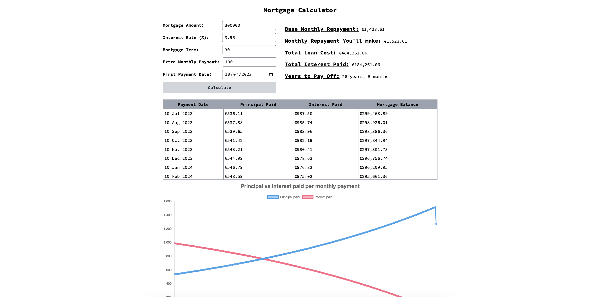

# Mortgage Data

This is a simple app built with [Sveltekit](https://kit.svelte.dev/) that allows you to calculate the following based on the mortgage amount, the interest rate and the mortgage term.

1. Your monthly repayment.
2. The total cost of the loan
3. The total interest you'll pay
4. How much of each monthly payment goes to the loan vs interest
5. How paying extra each month can reduce your mortgage term + the interest you'll pay.

The app is deployed [here](https://mortgage.smithy.dev/)

_The Formulas used to calculate figures are are standard forumulas the banks should use, however these figures are meant as a guide only. Before taking any financial action always consult a professional._
